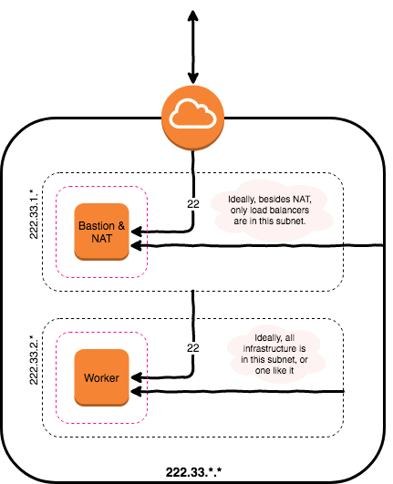

# Rudimentary AWS Setup [with Terraform]
This repository contains a [Terraform](https://www.terraform.io) script to instantiate a minimally-functional AWS infrastructure as follows:

* VPC
	* Public Subnet
		* Bastion/NAT host
	* Private Subnet
		* Empty/Sample EC2 instance

1. **Routing tables** to facilitate communication between various constituents of the infrastructure and The Internet. Routing tables enabling intra-VPC traffic exist by default and require no explicit creation.

1. The **public subnet** is accessible form the WWW via an Internet Gateway, private one is not; because there's no route from it to the Internet Gateway.
1. All subnets can "dial-out" to WWW.
	* Public subnet through the Internet Gateway.
	* Private subnet through the Bastion/NAT, which in turn connects to the WWW through the Internet Gateway.
1. **Bastion/NAT** host has a public IP and is wrapped in a security group which accepts SSH (port 22) connections from The Intenet, any connection from the VPC (all subnets), and allows all traffic out.
1. **Empty EC2 instance** is wrapped in a security group accepting SSH connections from the public subnet, any connection from its own subnet, and allows all outbound traffic.

Non-standard CIDR `222.33.0.0/16` is chosen to limit confusion, as every VPC tutorial inexplicably uses `10.0.0.0/16`.  Ample comments are provided inline.

## Network Diagram
The setup is concisely illustrated below.  Outbound traffic is not shown for the sake of brevity.

## Installation
* Install [Terraform](https://www.terraform.io)
* `terraform plan`
* `terraform apply`